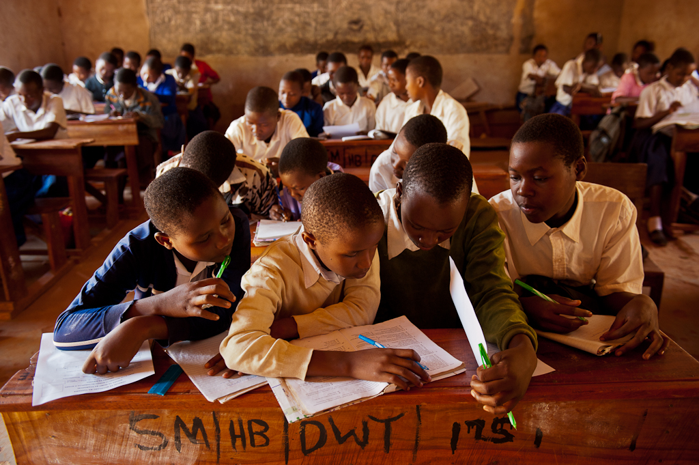

# A Peer-to-Peer Educational Platform 

To open-up more possibilities for learning and positive solution for our world, Take Action Global envison to create a fully peer-to-peer educational platform which will be built on top of the ThreeFold Grid. This will give the possibility to connect millions of students and teachers together. This will give the ability to set up global projects to tackle climate change and other issues and allowing students to connect, brainstorm, create, share, solve problems and take actions - A Climate Education for all!

Each student and teacher will be gifted with Digital Twin for Life that will grant them a unique digital identity forever while being in a fully private and secured digital world - They will have full control over their data, no one else. 

The Educational Platform will incorporate the different experiences built on top of Digital Twin to facilitate collaboration: 
- **Chat**: Students & teachers will be able to communicate with their friends and colleagues on a heart-to-heart way 
- **Meet**: The first peer-to-peer video conferencing tool
- **Office**: The ability to create and edit documents 
- **File Storage**: A place to store your files & documents in a fully secured way. 

> The Education Platform is under production and will be available soon. 

Below is a short video and message from Koen Timmers, Co-Founder of Take Action Global. 

<iframe width="560" height="315" src="https://vimeo.com/414512607" frameborder="0" allow="accelerometer; autoplay; encrypted-media; gyroscope; picture-in-picture" allowfullscreen></iframe>

Learn more about [Digital Twin](www.info.mydigitaltwin.io).

