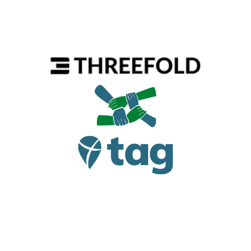

# Our Solution

ThreeFold and Take Action Global along with their Climate Action Projects joined forces to regenerate the earth and empower climate education to students from all around the world. 

The following will guide you towards the different solutions: 
  - [Planet Positive Farming](planet_positive_farming): ThreeFold new farming model to regenerate the earth
  - [Carbon Credit Model](carbon_credit_model): Our new approach towards carbon credit 
  - [Climate Action Program](climate_action_program): An empowering project 
  - [Digital Twin](digital_twin): Experience a new type of climate education

