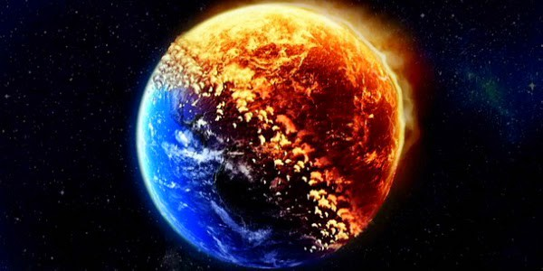

# Carbon Credit Problem  

We do not have enough time. In order to mitigate the impacts of global warming many experts beleive that our greenhouse gas emissions need to be reduced 80% below 1990 levels by 2050. 

> **This reduction has no chance of being reached through a voluntary cap and trade system utilizing the free market system.**

Unfortunately, carbon credits (one credit equals a one metric ton reduction) and carbon offsets on financial market are the primary tools being used as a way to reduce emissions on an industrial scale. Credits can be exchnaged between businesses or purchased or sold in the markets - this is now a well established market. In 2006, about 5.5 billion dollars of credits were purchased. Some experts expect this market to reach a trillon dollars within a decade. But why have these market taken off? The answer is simply because there is huge amount of money to be made. These markets are simply the indulgence of societies which want to carry on with business as usual. The consequence of business as usual are ecological disaster. 

The carbon trading system works by allowing carbon reducing industries to accumulate credits which they can sell as carbon offsets to businesses which either voluntarily want to reduce emissions or whose regulator caps require emission reductions. **The problem is that the polluting industries are not reducing their greeenhouse gas emissions!** Using the free market model, the polluters too often make the decision that the cost of reducing their emissions through the utilization of better technologies, conservation, and higher efficiency standard are restricted. It is cheaper to pollute and buy credits than it it to change their production processes. 

Now, companies are specializing themselves in making carbon-reducing technologies, so that they can sell carbon credit on the market - A huge profit making business model. Because credit and offsets offer the potential of profit, there can be a sort of perverse incentive for companies to maximize their carbon footprint so that they can later get credit for cutting back. 

Moreover, there are often potential secondary ecological and human impacts in the creation of carbon credits. One of the most serious related-case example involves a 220 square mile plantation of Eucalyptus and pine in Andean Ecuador. This carbon credit-generating plantation has resulted in the destruction of a native forest, the introduction of damaging invasive species, a reduction in biological diversity, the release of massive amounts of soil carbon, and the displacement of indigenous peoples. 

> **ThreeFold & Take Action Global do not want that!**

