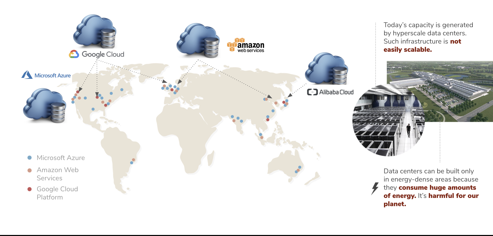

# Centralized Data Centers 

The current Internet [consumes about 10% of global energy production](https://www.researchgate.net/publication/255923829_Emerging_Trends_in_Electricity_Consumption_for_Consumer_ICT). With the imminent boom of emerging technologies such as edge computing, Internet of Things (IoT), 5G, Artificial Intelligent and Virtual Reality, the Internet’s energy consumption is [expected to increase exponentially](https://www.gartner.com/en/newsroom/press-releases/2017-02-07-gartner-says-8-billion-connected-things-will-be-in-use-in-2017-up-31-percent-from-2016).

Today, more than 80% of the Internet’s capacity is owned by centralized cloud providers. The capacity is derived from hyper-scale data centres - an incredibly costly infrastructure, not scalable and super unsustainable. As of today, the Internet consumes about 10% of global energy resources.

The current industry's solutions focus on increasing the use of renewable energies to power data centers. However this is not a viable solution as data centers consume enormous amounts of energy. Therefore, a new solution that can drastically reduce the global Internet’s energy consumption is needed. 

***Source: https://www.visualcapitalist.com/visualizing-the-power-consumption-of-bitcoin-mining/***

# Mobilizing huge amount of green energy resources

One of the main corporate goal of big Tech companies is to become carbon neutral or use 100% renewable energy but is it really sustainable? Should they not review the whole architecture behind? 

Google, for instance, declared that in 2020, they used 100% of its global electricity use with purchases of renewable energy. 

The energy used by a single google search is equivalent to turning on a 60W light bulb for 17 seconds - Now consider that people conduct over 1 billion searches a day, and we have a massive energy footprint of roughly 12.5 million watts. These million watts of energy footprint could have been reduced through a whole review of their current technological infrastructure - Considering also that their centralized data centers collectively burn through (approximately) 260 million watts. 

Using 100% renewable energy by such big tech monopolizes the whole renewable energy distribution. Below are some facts that may trigger some reflections about how unsustainable and unequal is our current society: 
- Around 11% of the global primary energy came from renewale technologies
- 940 million people (13% of the world) do not have access to electricity
- 3 billion people (40% of the world) do not have access to clean fuels for cooking. This comes at a high health cost for indoor air pollution. 

# Decentralized attempt by Bitcoin 

Bitcoin made a great step towards the decentralization of the network where currency could be sent without the need for intermediaries. However, to power this network, electricity is the main requirements when it comes to bitcoin mining. 

The annual power consumption of the Bitcoin network was estimated to be 129 Terawatt-hours (TWh)**. 

***Source: https://www.visualcapitalist.com/visualizing-the-power-consumption-of-bitcoin-mining/***

From a study carried out by the University of Cambridge, Bitcoin consumes more energy than countries like Norway. Additionally, Bitcoin network consumes 1,708% more electricty than Google, but 39% less than all of the world's data centers. 

Note: 

** A terawatt hour (TWh) is a measure of electricity that represents 1 trillion watts sustained for one hour.

## ThreeFold Solution 

ThreeFold today brings the largest peer-to-peer Internet grid on the planet. It uses pioneering technologies that remove the need for centralized and power-hungry data centers, consumes up to 90% less energy, and uses up to 90% less international fiber network capacity. (To learn about ThreeFold power savings, read [here](https://farming.threefold.io/blog/post/for_our_planet/).