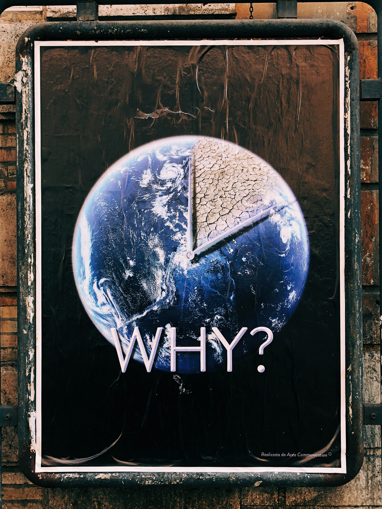

We live in an era where we are losing our connection with our Planet Earth - the biodiversity, natural ecosystem and nature that make life possible. 

The urge for taking action against climate change as a collective is manifesting itself in various ways: 
- [Our planet is dying](planet_dying)
- [Current centralized infrastructure is unsustainable](centralized_unsustainable)
- [Carbon Credit Problem](carbon_credit_problem)

