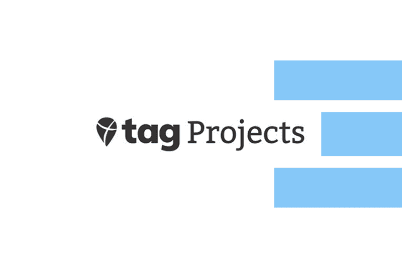

# Threefold | Take Action Global 

Welcome to **ThreeFold|Take Action Global** Knowledge-Based. Here, you will find all the relevant information around the synergy between ThreeFold and Take Action Global 

To start: 

Read **[this simplified ThreeFold introduction](tf_introduction)** or watch the short video below:

<iframe width="560" height="315" src="https://www.youtube.com/embed/5DtVU66Z74s" frameborder="0" allow="accelerometer; autoplay; encrypted-media; gyroscope; picture-in-picture" allowfullscreen></iframe>

 

Please go through **[Take Action Global project description](tag_introduction)** or watch the short video below: 

<iframe width="560" height="315" src="https://www.youtube.com/watch?v=B9uMsPv0qqs" frameborder="0" allow="accelerometer; autoplay; encrypted-media; gyroscope; picture-in-picture" allowfullscreen></iframe>

## More Online Resources 

- **[Threefold main website](https://threefold.io)**: Helps you navigate throughout the ThreeFold universe based on your interest(s) in the project.
    - **[Be The Internet](https://farming.threefold.io)**: Join the Internet economy by hosting a server at your home or office.
    - **[Alliance for a Conscious Internet](https://consciousinternet.org)**: A collective ecosystem of planet and human centric projects.
    - **[ThreeFold Marketplace](https://marketplace.threefold.io)**: Empower your community with peer-to-peer applications and tools.
    - **[Your P2P Cloud](https://cloud.threefold.io)**: Build secure software, applications, and open Internet services.
    - **[The Antidote to the Cyber Pandemic](https://threefold.tech)**: Dig deeper into the technology behind the TF Grid.
    - **[Digital Twin](https://mydigitaltwin.io)**: Own your data. The next-level end user experience that will change everything!
- **[Take Action Global main website](https://www.takeactionglobal.org/)**: Their mission is to empower students, teachers and partner to reverse climate.
  - **[Climate Action Project](https://www.climate-action.info/)**: A project aiming at changing students' behavior and societies' mindset concerning climate change and environmental threats through educacation.

- **[ThreeFold News Telegram Channel](https://t.me/threefoldnews)**: Stay updated on what is our most recent announcements and updates.
- **[The ThreeFold Forum](https://forum.threefold.io)**: The perfect place for you to share, connect, & ask questions.
