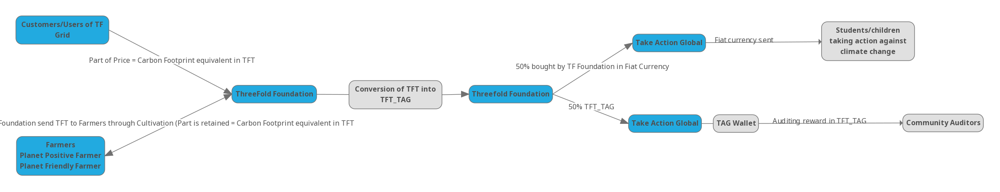

# Carbon Action Program 

This project aims to change student's behavior and societies' mindset concerning climate change and environmental threats through education. Climate Education is crucial to encourage climate action - helping people to understand and address the impacts of the climate crisis, empowering them with the knowledge, skills, values and attitudes needed to act as agents of change. With **Take Action Global** and **Climate Action Project**, the aim is not just to teach children them in classes about climate change but to involve them in real case where they can brainstorm, discuss and find a solution, as a collective, regarding the problematic. 

ThreeFold joined forces with Take Action Global & Climate Action Project to create the first ever planet positive grid in the world. Stakeholders, users and farmers will contribute in offsetting their carbon footprint by supporting students and children who are taking action against climate change. 

Instead to buying carbon credit on the carbon market, we wanted to tackle climate change from another angle which seems more direct, heart-to-heart,transparent, sustainable and empowering.

See more how the whole ecosystem is contributing to climate change, [here](carbon_credit_model).