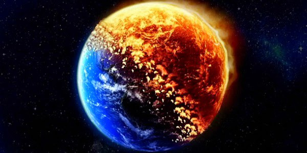

# Our Planet is Dying 

Humanity is running towards a scary future of mass extinctions, health crises and constant climate-induced disruptions to society. 

Climate disruption, biodiversity decline and human overconsumption & overpopulation - scientists and researchers predicted that these crises are poised only to escalate in the coming decades due to global climate change. They will put Earth in a more precarious position than most people realize and could even jeopardize the human race. 

Since the start of agriculture 11,000 years ago, Earth has lost an estimated 50% of its terrestrial plants and roughly 20% of its animal biodiversity. If the current trends continue, about 1 million of Earth’s 7 to 10 million plant & animal species could face extinction in the near future. Such an enormous loss of biodiversity will also disrupt every major ecosystem on the planet - fewer insects to pollinate plants, fewer plants to filter the air, water and soil and fewer forest to protect human settlements from floods and other natural disasters. 

These disasters, coupled with climate-induced droughts and sea-level rise, could 1 billion people would become climate refugees by the year 2050, forcing mass migrations that further endanger human lives and disrupt communities & society. 

